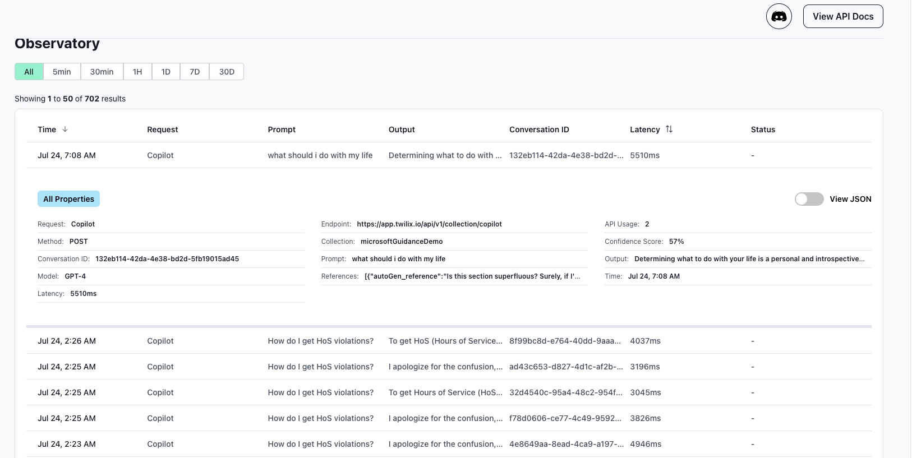

# PDFAgent

A production-ready PDF agent for reading, analysing and conversing with your PDF built for business-critical use cases on retrieval-augmented generation.

Got questions/need support? Join our discord here: https://discord.gg/a3K9c8GRGt

# Features

✅ Production-ready PDFReaderAgent - built with Rest API (see docs.twilix.io for more information)  
✅ Built-in observability (via Twilix dashboard)  
✅ Built-in easily swappable read/write API keys (so no one can over-write your data)  
✅ Production-ready insertion and retrieval pipelines built in (via Twilix)  
✅ Multi-line citations, managed vector store, production-ready conversation memory handling.

## Installation

You can install it easily using the following: 

```bash
pip install pdfagent
```

## QuickStart

You can get started quickly by grabbing your API key from https://app.twilix.io/.

```python
from PDFAgent import PDFAgent
agent = PDFAgent(
    name="AgentExample",
    api_key="XXX"
)
```

### Inserting a PDF 

You can insert a PDF in just 1 line of code - under the hood, we take care of OCR, preprocessing,
vectorising, splitting and storage.

```python
agent.insert_pdf(
    "https://www.w3.org/WAI/WCAG21/working-examples/pdf-table/table.pdf"
)
```

Once it's inserted, we recommend giving it 30 to 60 seconds to properly index.

If you have a local, PDF, we recommend uploading and inserting via 
the https://app.twilix.io dashboard.

### Now ask questions!

```python
agent.ask("What is this PDF about?")
```

### Built-in observatory

Once you set it up - you get a free monitoring and observatory!
This includes: 
- Monitoring input queries
- Monitoring output queries
- Latency
- Retrieval results



### Ask for a co-pilot analysis!

```python
agent.copilot("How many participants are there in total?")
```

### Powerful templating for any desired output:

You can then use out-of-the-box templating where you by inserting a
`{reference}` so that users can get a clean abstraction.

```python
agent.template("""How many participants are there in total? Please respond in a JSON with the key `total_participants`.

{reference}
JSON:""")
```

# See More

Interested in exploring further?
Find out more from https://docs.twilix.io.
